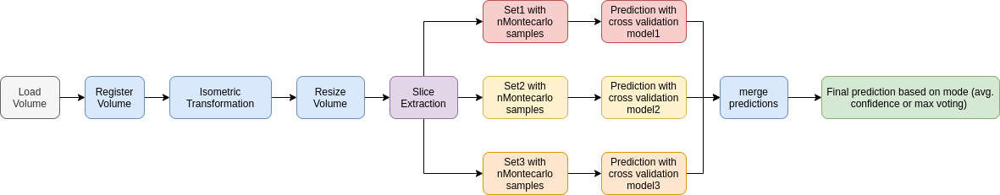

# mri-face-detector
Identify non-defaced datasets before publication

### Installation
`git clone git@github.com:poldracklab/mri-face-detector.git`

`python3 setup.py install`


### Usage

```
from defacing.helpers.utils import load_volume
from defacing.inference import inferer

inferer = inferer()
path = '../sample_vols/faced/example5.nii.gz'
vol = load_volume(path)
label = inferer.infer(vol)
```

### Required Libraries

+ imgaug
+ nibabel 
+ SimpleITK
+ numpy
+ tensorflow


### Results on heldout validation set

> sensitivity: 0.945

> specificity: 0.949

> accuracy: 0.948

### Method

